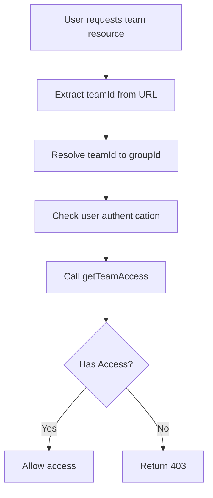
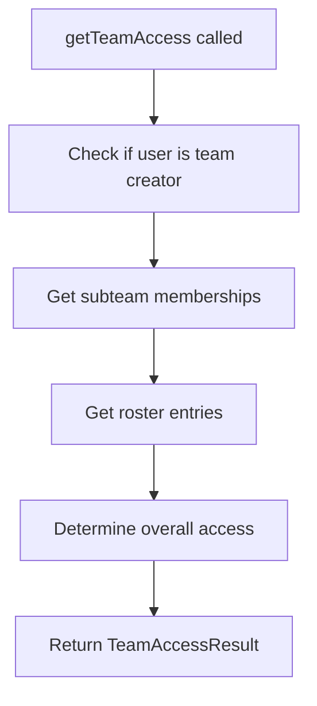
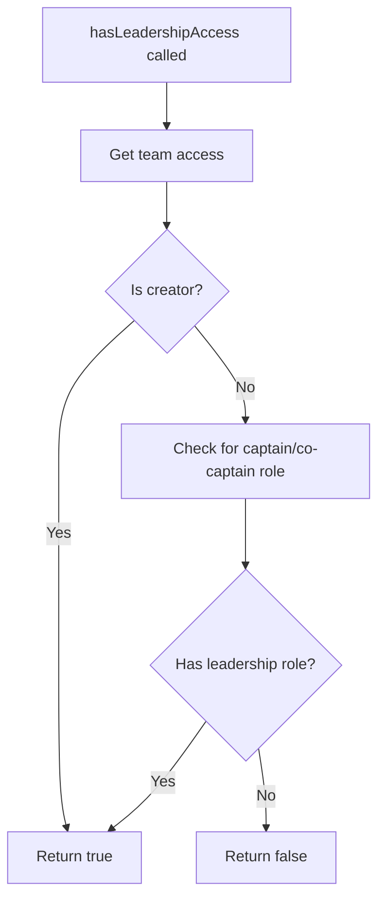

# Team Authentication and API Documentation

## Overview

This document provides comprehensive documentation of the team authentication system and all API routes in the Scio.ly application. The system uses a clean, modern approach with Drizzle ORM for database operations and extensive logging for development.

## Table of Contents

1. [Authentication System](#authentication-system)
2. [API Routes Overview](#api-routes-overview)
3. [Database Schema](#database-schema)
4. [Authentication Flow](#authentication-flow)
5. [API Route Details](#api-route-details)
6. [Development Logging](#development-logging)
7. [Error Handling](#error-handling)

## Authentication System

### Core Concepts

The team authentication system is built around three key concepts:

1. **Team Groups**: The top-level organization (e.g., "Neuqua Valley C")
2. **Subteams**: Individual teams within a group (e.g., "Team A", "Team B")
3. **Team Creator**: The user who created the team group (has special privileges)

### Authentication Levels

#### 1. Team Group Access
Users can access a team group if they are:
- **Team Creator**: Always has full access
- **Subteam Member**: Has active membership in any subteam
- **Roster Entry**: Has their name in any subteam's roster

#### 2. Leadership Access
Users have leadership privileges if they are:
- **Team Creator**: Always has leadership
- **Captain/Co-Captain**: Has leadership role in any subteam

### Authentication Implementation

The authentication system is implemented in `src/lib/utils/team-auth-v2.ts`:

```typescript
// Main authentication function
export async function getTeamAccess(userId: string, groupId: string): Promise<TeamAccessResult>

// Leadership check
export async function hasLeadershipAccess(userId: string, groupId: string): Promise<boolean>

// Subteam-specific access
export async function canAccessSubteam(userId: string, groupId: string, subteamId: string): Promise<boolean>
```

## API Routes Overview

### Core Team APIs

| Route | Method | Purpose | Frontend Usage |
|-------|--------|---------|----------------|
| `/api/teams/[teamId]/members` | GET | Get team members | teamStore, hooks, PeopleTab |
| `/api/teams/[teamId]/roster` | GET/POST | Manage roster data | teamStore, hooks, RosterTab |
| `/api/teams/[teamId]/assignments` | GET/POST | Manage assignments | teamStore, hooks, assignmentUtils |
| `/api/teams/[teamId]/stream` | GET/POST/PUT/DELETE | Stream posts | teamStore, hooks, StreamTab |
| `/api/teams/[teamId]/timers` | GET/POST/DELETE | Event timers | teamStore, hooks, StreamTab |
| `/api/teams/[teamId]/tournaments` | GET | Tournament data | teamStore, hooks |
| `/api/teams/[teamId]/subteams` | GET/POST | Manage subteams | teamStore, hooks, TeamDashboard |

### Team Management APIs

| Route | Method | Purpose | Frontend Usage |
|-------|--------|---------|----------------|
| `/api/teams/user-teams` | GET | Get user's teams | teamStore, hooks, calendar |
| `/api/teams/create` | POST | Create new team | TeamsPageClient |
| `/api/teams/[teamId]/invite` | GET/POST | Invite users | PeopleTab |
| `/api/teams/[teamId]/roster/invite` | GET/POST | Roster linking | RosterLinkIndicator, PeopleTab |
| `/api/teams/[teamId]/members/promote` | POST | Promote members | PeopleTab |
| `/api/teams/[teamId]/roster/remove` | POST | Remove roster entries | PeopleTab |
| `/api/teams/[teamId]/members/remove` | POST | Remove members | PeopleTab |

### Calendar APIs

| Route | Method | Purpose | Frontend Usage |
|-------|--------|---------|----------------|
| `/api/teams/calendar/events` | GET/POST | Team events | TeamCalendar |
| `/api/teams/calendar/recurring-meetings` | GET/POST | Recurring meetings | TeamCalendar |
| `/api/teams/calendar/personal` | GET | Personal events | TeamCalendar |

## Database Schema

### Core Tables

#### `new_team_groups`
- **Purpose**: Top-level team organization
- **Key Fields**: `id`, `slug`, `school`, `division`, `created_by`
- **Relationships**: One-to-many with `new_team_units`

#### `new_team_units`
- **Purpose**: Individual subteams within a group
- **Key Fields**: `id`, `group_id`, `team_id`, `description`, `created_by`
- **Relationships**: Many-to-one with `new_team_groups`, one-to-many with `new_team_memberships`

#### `new_team_memberships`
- **Purpose**: User membership in subteams
- **Key Fields**: `user_id`, `team_id`, `role`, `status`
- **Roles**: `captain`, `co_captain`, `member`

#### `new_team_roster_data`
- **Purpose**: Student roster entries for events
- **Key Fields**: `user_id`, `team_unit_id`, `student_name`, `event_name`

#### `users`
- **Purpose**: User profiles and authentication
- **Key Fields**: `id`, `email`, `display_name`, `first_name`, `last_name`

## Authentication Flow

### 1. User Access Request



### 2. Team Access Check



### 3. Leadership Check



## API Route Details

### Members API (`/api/teams/[teamId]/members`)

**Purpose**: Get team members with their roles and subteam information

**Authentication**: Requires team group access

**Process**:
1. Resolve team slug to group ID
2. Check user access using `getTeamAccessCockroach`
3. Add team creator if applicable
4. Fetch subteam memberships using Drizzle ORM
5. Fetch user profiles using Drizzle ORM
6. Combine and format member data

**Response**:
```typescript
{
  members: Array<{
    id: string;
    name: string;
    email: string;
    role: string;
    subteam: {
      id: string;
      name: string;
      description: string;
    } | null;
    isCreator: boolean;
    events: string[];
  }>
}
```

### Roster API (`/api/teams/[teamId]/roster`)

**Purpose**: Manage student roster data for events

**Authentication**: Requires team group access

**GET Process**:
1. Resolve team slug to group ID
2. Check user access
3. Fetch roster data using Drizzle ORM
4. Return formatted roster entries

**POST Process**:
1. Validate user access and leadership
2. Update roster data using Drizzle ORM
3. Return success confirmation

### Assignments API (`/api/teams/[teamId]/assignments`)

**Purpose**: Manage team assignments

**Authentication**: 
- GET: Requires team group access
- POST: Requires leadership access

**Process**:
1. Resolve team slug to group ID
2. Check appropriate access level
3. Perform database operations using Drizzle ORM
4. Return formatted data

### Stream API (`/api/teams/[teamId]/stream`)

**Purpose**: Manage team stream posts and comments

**Authentication**: 
- GET: Requires team group access
- POST/PUT/DELETE: Requires leadership access

**Operations**:
- **GET**: Fetch stream posts for subteam
- **POST**: Create new stream post
- **PUT**: Edit existing post
- **DELETE**: Delete post

### Timers API (`/api/teams/[teamId]/timers`)

**Purpose**: Manage event timers

**Authentication**: 
- GET: Requires team group access
- POST/DELETE: Requires leadership access

**Operations**:
- **GET**: Fetch active timers
- **POST**: Add new timer
- **DELETE**: Remove timer

## Development Logging

### Logging Format

All API routes use a consistent logging format with emojis for easy identification:

```
🔍 [API_NAME] Action description
✅ [API_NAME] Success message
❌ [API_NAME] Error message
📋 [API_NAME] Request details
🔐 [API_NAME] Authentication info
👥 [API_NAME] Member operations
👤 [API_NAME] User operations
👑 [API_NAME] Creator operations
```

### Logging Levels

1. **Request Start**: Log when API request begins
2. **Authentication**: Log authentication checks and results
3. **Database Operations**: Log database queries and results
4. **Business Logic**: Log key business logic steps
5. **Success/Error**: Log final outcomes with timing

### Example Log Output

```
🔍 [MEMBERS API] GET request started { timestamp: '2024-01-15T10:30:00.000Z', url: '/api/teams/neuqua-c-abc123/members' }
📋 [MEMBERS API] Request params { teamId: 'neuqua-c-abc123', subteamId: null, userId: 'user-456' }
🔍 [MEMBERS API] Resolving team slug to group ID
✅ [MEMBERS API] Team group resolved { teamId: 'neuqua-c-abc123', groupId: 'group-789' }
🔐 [MEMBERS API] Checking team access
🔐 [MEMBERS API] Team access result { userId: 'user-456', groupId: 'group-789', teamAccess: { hasAccess: true, isCreator: true, hasSubteamMembership: false, hasRosterEntries: false, subteamRole: undefined, subteamMemberships: 0, rosterSubteams: 0 } }
👑 [MEMBERS API] Adding team creator to members list
👑 [MEMBERS API] Team creator added { userId: 'user-456', name: 'John Doe' }
🔍 [MEMBERS API] Fetching subteam memberships
✅ [MEMBERS API] Fetched subteam memberships { count: 3, members: [...] }
👤 [MEMBERS API] Fetching user profiles { userIds: ['user-123', 'user-456', 'user-789'] }
✅ [MEMBERS API] Fetched user profiles { count: 3, profiles: [...] }
✅ [MEMBERS API] Request completed successfully { duration: '245ms', memberCount: 4, teamId: 'neuqua-c-abc123', subteamId: null, userId: 'user-456' }
```

## Error Handling

### Error Types

1. **Authentication Errors** (401/403)
   - Missing user authentication
   - Insufficient permissions
   - Team access denied

2. **Validation Errors** (400)
   - Missing required parameters
   - Invalid data format
   - Business rule violations

3. **Not Found Errors** (404)
   - Team not found
   - Resource not found

4. **Server Errors** (500)
   - Database connection issues
   - Unexpected errors

### Error Response Format

```typescript
{
  error: string;
  details?: string;
  timestamp?: string;
}
```

### Error Logging

All errors are logged with:
- Error message and stack trace
- Request context (teamId, userId, etc.)
- Duration of request
- Timestamp

## Best Practices

### 1. Use Drizzle ORM
- Prefer Drizzle ORM over raw SQL queries
- Use type-safe database operations
- Leverage Drizzle's query builder

### 2. Consistent Authentication
- Always use `getTeamAccessCockroach` for access checks
- Use `hasLeadershipAccessCockroach` for leadership checks
- Log authentication results for debugging

### 3. Comprehensive Logging
- Log at key decision points
- Include relevant context in logs
- Use consistent emoji prefixes
- Log timing information

### 4. Error Handling
- Provide meaningful error messages
- Log errors with full context
- Return appropriate HTTP status codes
- Handle edge cases gracefully

### 5. Performance
- Use database indexes effectively
- Minimize database queries
- Cache frequently accessed data
- Log performance metrics

## Migration Notes

### From Legacy System

The current system replaces the legacy authentication system with:

1. **Clean API**: Single source of truth for team access
2. **Drizzle ORM**: Type-safe database operations
3. **Comprehensive Logging**: Development-friendly debugging
4. **Team Creator Support**: Proper handling of team creators
5. **Consistent Authorization**: Unified access control

### Breaking Changes

1. **Removed APIs**:
   - `/api/teams/[teamId]/stream-data` (replaced with parallel calls)
   - `/api/teams/[teamId]/assignments/enhanced` (unused)

2. **Updated Authentication**:
   - All APIs now use `team-auth-v2.ts`
   - Team creators have special privileges
   - Consistent access control across all routes

3. **Enhanced Logging**:
   - All APIs now have extensive development logging
   - Consistent log format with emojis
   - Performance timing included

## Conclusion

This authentication and API system provides a robust, scalable foundation for team management in the Scio.ly application. The use of Drizzle ORM ensures type safety, while comprehensive logging makes development and debugging efficient. The clean separation of concerns and consistent patterns make the system maintainable and extensible.
